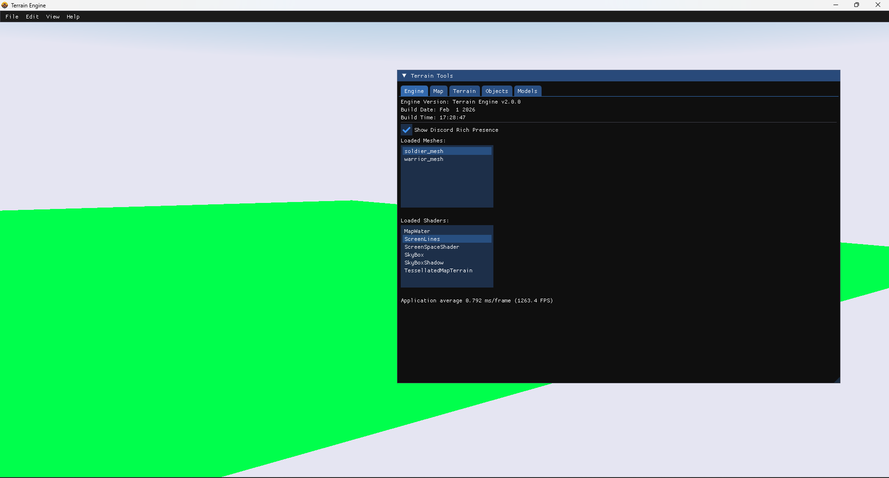
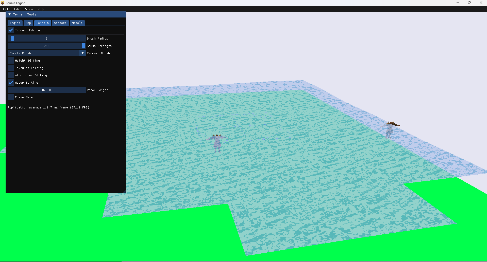
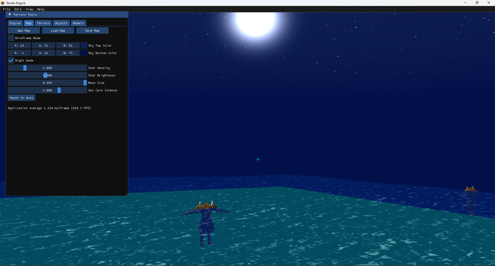
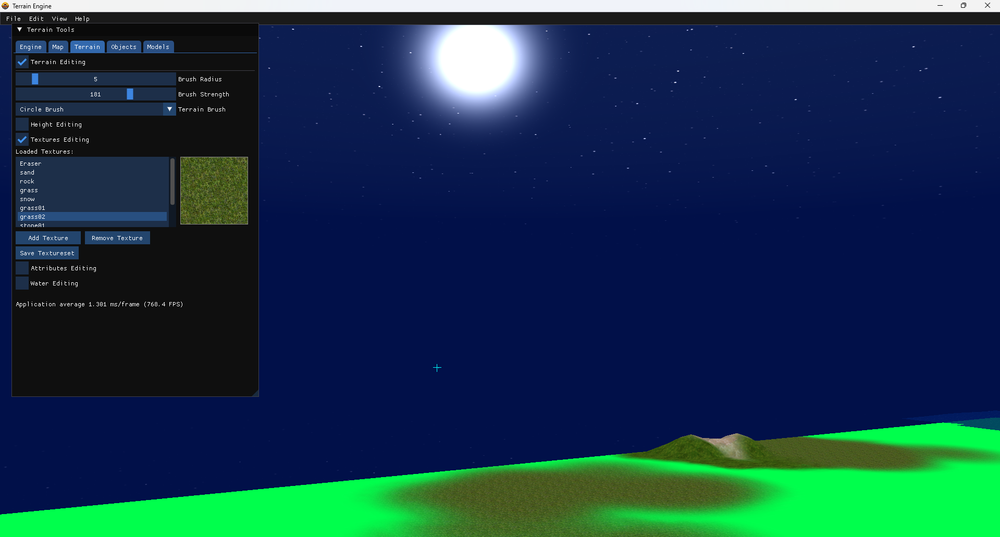
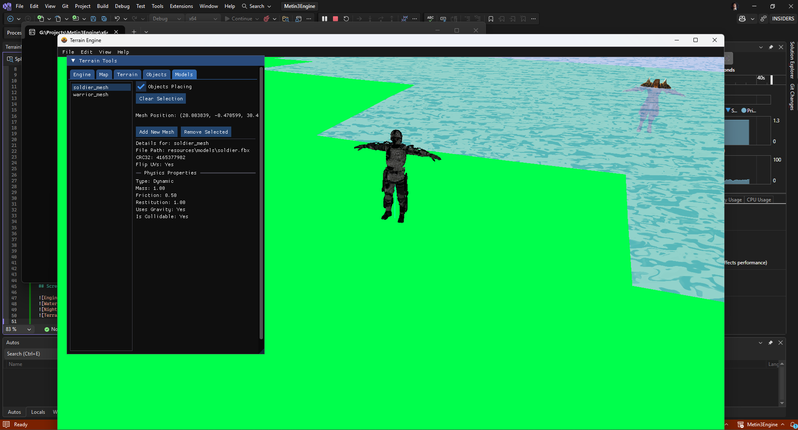

# Metin3Engine: A Modern C++ Game Engine

## Description

Metin3Engine is a custom-built 3D game engine developed from the ground up in modern C++. It's a comprehensive project showcasing advanced rendering techniques, a robust architectural design, and a suite of in-engine tools for content creation. The engine is designed to handle large, open-world terrains and dynamic objects, with a focus on performance and modern graphics APIs.

This project serves as a deep dive into the architecture and systems that power modern games, including rendering pipelines, resource management, physics, and editor tooling.

## Features

This engine is more than just a renderer; it's a collection of integrated systems that work together to create a dynamic 3D world.

- **Advanced Rendering Pipeline:**
	- Dynamic Water System: Features a sophisticated water rendering system with separate passes for reflections and refractions, calculated in real-time using clipping planes.
	- Shadow Mapping: Implements a shadow pass to generate dynamic shadows from objects and the terrain, adding depth and realism to the scene. (In Development)
	- Procedural Skybox: The sky is generated procedurally with a dynamic shader, allowing for time-of-day cycles and atmospheric effects, rather than relying on a static cubemap.
	- Splat Mapping: The terrain supports texture splatting, allowing for the blending of multiple high-resolution textures based on a weight map.

- **Asynchronous Asset Loading:**
	- Leverages modern C++ concurrency (std::async, std::future) to load large assets like 3D models and textures on a background thread. This prevents the main game loop from freezing, ensuring a smooth experience even when loading complex scenes.

- **Robust Engine Architecture:**
	- Manager Classes: Follows a clean, decoupled design using manager classes for different subsystems (e.g., MeshManager, ResourceManager, CameraManager).
	- Modern C++: Utilizes modern C++ features like smart pointers (std::shared_ptr, std::unique_ptr) and memory pooling (Dynamic.h) for safe and efficient memory management.

- **In-Engine Editor & Tooling:**
	- ImGui Integration: Features a powerful, built-in editor powered by ImGui. 
	- Live Editing: Allows for real-time manipulation of the scene, including adding/removing objects, editing terrain heightmaps, painting textures, and modifying physics properties, with all changes being saved back to data files.

## Technology Stack

The engine is built with a focus on modern, high-performance technologies.

- **C++17**: The engine is developed using modern C++ standards, ensuring type safety, performance, and maintainability.
- **OpenGL**: The rendering backend uses OpenGL for graphics rendering, leveraging shaders for advanced visual effects.
- **ImGui**: Integrated for the in-engine editor, providing a user-friendly interface for scene manipulation and debugging.
- **GLM**: Used for mathematics and vector operations, providing a robust framework for 3D transformations and
- **Assimp**: For importing various 3D model formats, enabling the engine to work with a wide range of assets.
- **STB Image**: For loading textures, providing a simple and efficient way to handle image files.
- **nlohmann**: For JSON parsing, enabling easy configuration and data management within the engine.
- **meshoptimizer**: For optimizing 3D meshes, reducing draw calls and improving rendering performance.

This project is a personal endeavor to explore the depths of game engine development. Feel free to explore the code, and I welcome any feedback or suggestions.

## Screenshots

